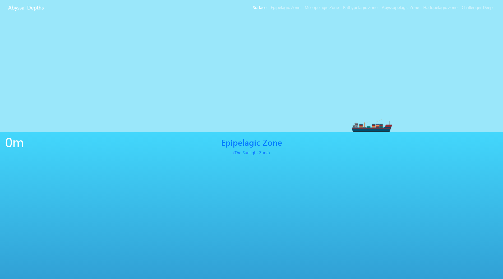
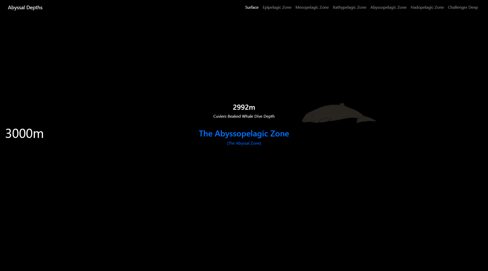
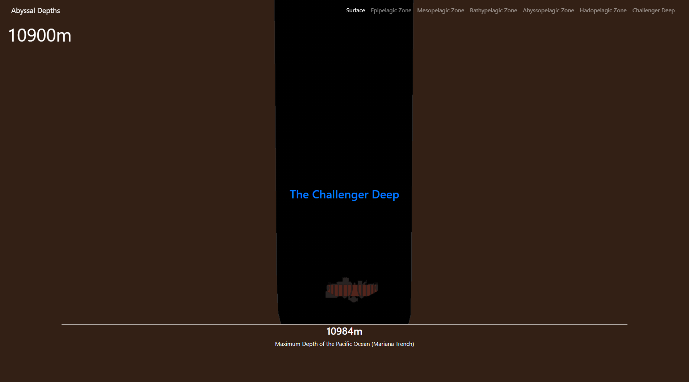

# Abyssal Depths
Abbyssal Depths is an educational tool to illustrate the vast depths of the planets oceans, using a 10 pixel - 1 meter scaling to accurately show just how far down you can go!

Access the website [here](https://cmjnorman.github.io/abyssal-depths/)!

Inspired heavily by [The Deep Sea](https://neal.fun/deep-sea/) by Neal Agarwal.

## Screenshots

